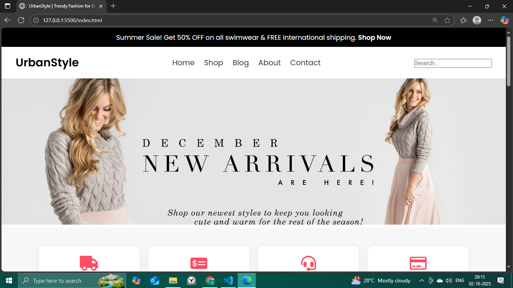
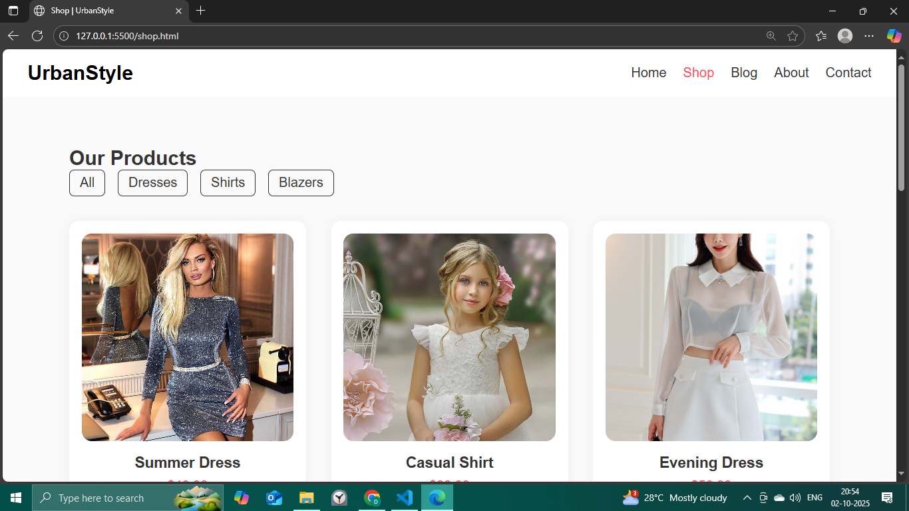
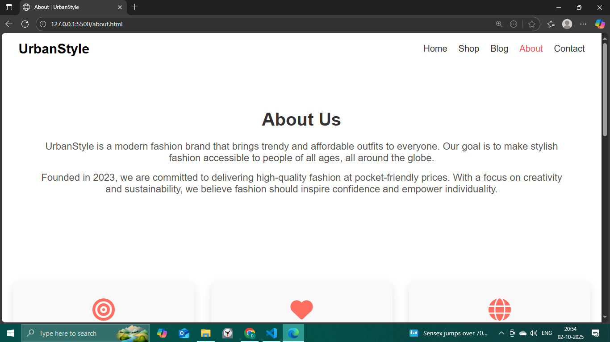
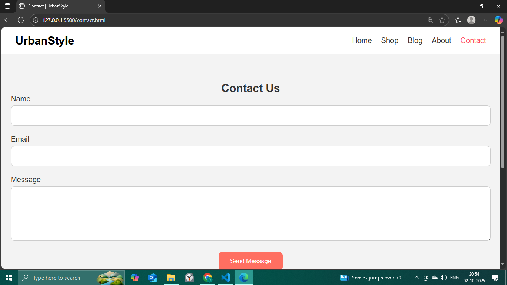

UrbanStyle - E-Commerce Responsive Website

🌐 Live Demo

Experience the live version of UrbanStyle here:
👉 https://ecommerce-website-dc.netlify.app/

🛍️ Project Overview

UrbanStyle is a modern, responsive e-commerce website that offers a wide range of trendy fashion products. The website includes multiple pages: Home, Shop, Blog, About, and Contact.

This project demonstrates your ability to build a frontend-focused web application using HTML, CSS, and JavaScript, with features like product filtering, responsive design, and user-friendly navigation.

🔹 Features

- Responsive Design: Fully responsive layout for mobile, tablet, and desktop screens using CSS media queries.
- Multi-page Website: Includes Home, Shop, Blog, About, and Contact pages.
- Product Display: Dynamic product listing with images, names, categories, and prices.
- Category Filters: Users can filter products by categories like Dresses, Shirts, Blazers, Jeans, Sneakers, and Boots.
- Navigation Menu: Intuitive navigation bar linking all pages.
- Footer Section: Contains quick links, support info, and social media links across all pages.
- Contact Form: Allows users to send messages (frontend-only, no backend integration).

⚙️ Tech Stack

- HTML5
- CSS3 (Flexbox, Grid, Media Queries)
- JavaScript (DOM Manipulation, Event Handling)

## 🎨 Screenshots

**Home Page**

**Shop Page**

**About Page**

**Contact Page**

🚀 Future Enhancements

- Add backend support to store and fetch products dynamically.
- Implement a shopping cart and checkout functionality.
- Integrate user authentication (login/signup).
- Add animations and more interactive UI elements.

📌 Author

Divya Chaturvedi
- Portfolio: https://divyachaturvedi.netlify.app/

